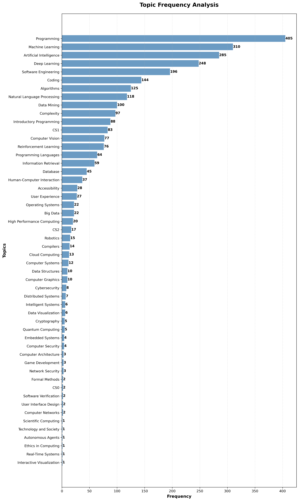

# ITiCSE 2025 WG2 Systematic Literature Review Tools
A collection of tools to help the systematic literature review for WG2 at ITiCSE 2025. Sample data in the folders.

The primary aim of the working group if to systematically review the literature on the use of generative AI in upper-level computer science education. The secondary aim is to survey evaluators on their experiences with generative AI in computer science education, specifically in the upper-level courses. The tertiary aim is to create a set of recommendations, competencies, guidelines, and best practices for the use of generative AI in upper-level computer science education to help teachers transition there courses into the generative age.

## Frequency of CS Subjects in paper collection



> Note: The chart above shows the frequency of various computer science subjects in the collected papers. However, this is the unfiltered set of papers, so there are many papers that are not relevant to the working group. The topics are simply extracted from the paper abstracts and titles using our curated list of computing topics (see: [`topics/topics.txt`](topics/topics.txt)).

## TF-IDF Analysis of most relevant topics

| Rank | Term | TF-IDF Score |
|------|------|--------------|
| 1 | code | 13.4955 |
| 2 | students | 12.8279 |
| 3 | llms | 12.7976 |
| 4 | education | 12.7923 |
| 5 | programming | 12.4588 |
| 6 | data | 11.6012 |
| 7 | software | 11.5439 |
| 8 | chatgpt | 10.1376 |
| 9 | generative | 9.7487 |
| 10 | model | 9.4851 |
| 11 | language | 9.0060 |
| 12 | generation | 8.7876 |
| 13 | computing | 8.5992 |
| 14 | models | 8.3428 |
| 15 | computer | 8.0766 |
| 16 | science | 7.9161 |
| 17 | tools | 7.8431 |
| 18 | learning | 7.7254 |
| 19 | design | 7.6917 |
| 20 | llm | 7.5936 |
| 21 | large | 7.5312 |
| 22 | knowledge | 7.4405 |
| 23 | image | 7.4364 |
| 24 | performance | 7.4238 |
| 25 | tasks | 7.3639 |

> Note: The table above shows the top 25 terms with the highest TF-IDF scores from the analysis of the collected papers. This indicates their relevance and importance in the context of generative AI in computer science education. The BibTeX file used for this is the best performing on the ACM DL, which is [`bibfiles/acm_fat_boy.bib`](bibfiles/acm_fat_boy.bib).

## Utilities

### tf-idf.py
Performs Term Frequency-Inverse Document Frequency analysis on BibTeX files to identify key terms and themes in academic literature.
```bash
python tf-idf.py -f bibfiles/acm_chatgpt.bib -o chatgpt_analysis.txt -v
```

### topic_frequency.py
Analyzes the frequency of specific topics within BibTeX files and generates horizontal bar charts for visualization.
```bash
python topic_frequency.py -t topics.txt -b bibfiles/acm_chatgpt.bib -p --max-topics 15
```

### find_dois.py
Searches the Crossref database to find DOIs for academic papers using their titles.
```bash
python find_dois.py -f paper_titles.txt -v -o found_dois.csv
```

### doi_overlap.py
Compares DOIs from a reference list with DOIs in BibTeX files to identify coverage gaps and overlaps.
```bash
python doi_overlap.py -d target_dois.txt -b my_bibliography.bib -v
```

### set_of_dois.py
Extracts all unique DOIs from multiple BibTeX files in a directory and creates a consolidated list.
```bash
python set_of_dois.py -d bibfiles/ -o unique_dois.txt -v
```

### check_dois_valid.py
Validates DOIs by checking them against the Crossref database to ensure they are legitimate and accessible.
```bash
python check_dois_valid.py -f doi_list.txt -c 5 -o validation_results.csv
```

### subject_vibe.py
Uses OpenAI's API to automatically classify academic papers into computer science course subjects based on titles and abstracts.
```bash
python subject_vibe.py -f bibfiles/acm_chatgpt.bib -o cs_classifications.csv -n 10 -v
```

## Requirements
- Python 3.6+
- matplotlib (for plotting): `pip install matplotlib`
- requests (for API calls): `pip install requests`
- openai (for subject classification; requires your own Open AI API Key): `pip install openai`

## Sample Workflow
0. Find DOIs from paper titles: `python find_dois.py -f paper_titles.txt`
1. Extract DOIs from your bibliography: `python set_of_dois.py -d bibfiles/`
2. Validate the DOIs: `python check_dois_valid.py -f unique_dois.txt`
3. Analyze topic frequencies: `python topic_frequency.py -t topics.txt -b bibfiles/acm_final.bib -p`
4. Perform TF-IDF analysis: `python tf-idf.py -f bibfiles/acm_final.bib -v`
5. Classify papers by CS course subject: `python subject_vibe.py -f bibfiles/acm_final.bib -o course_classifications.csv -n 20`
6. Analyze coverage against a validation set: `python doi_overlap.py -d target_dois.txt -b bibfiles/acm_final.bib`


