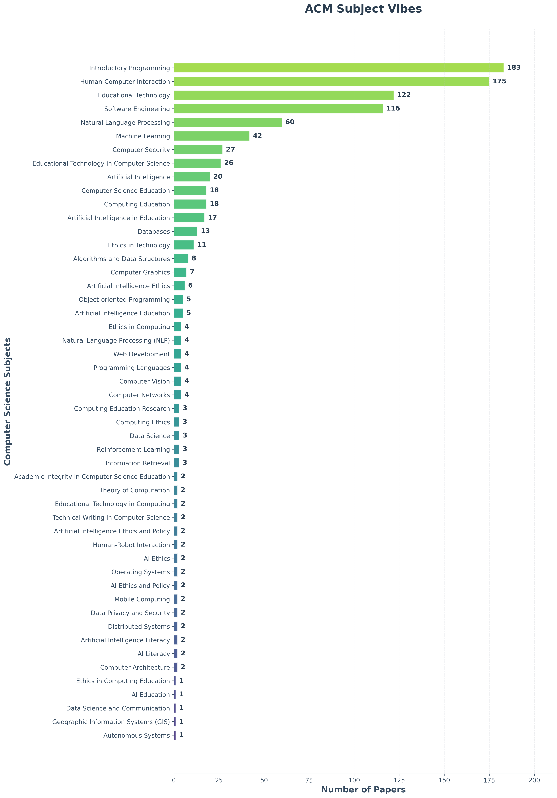
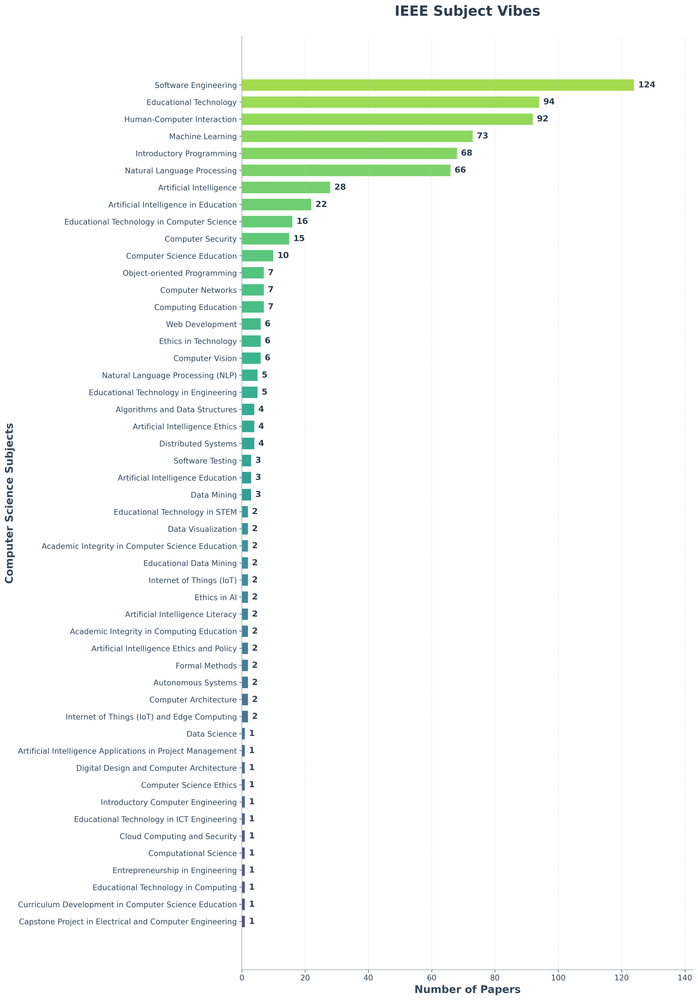

# ITiCSE 2025 WG2 Systematic Literature Review Tools
A collection of tools to help the systematic literature review for WG2 at ITiCSE 2025. Sample data in the folders.

The primary aim of the working group if to systematically review the literature on the use of generative AI in upper-level computer science education. The secondary aim is to survey evaluators on their experiences with generative AI in computer science education, specifically in the upper-level courses. The tertiary aim is to create a set of recommendations, competencies, guidelines, and best practices for the use of generative AI in upper-level computer science education to help teachers transition there courses into the generative age.

## Search String

The SRL is driven by the following search string:

Domain:
```sql
("computer science" OR "computer engineering" OR "software engineering" OR "computing education" 
OR "cs education" OR "csed" OR "cse")
```
Generative AI:
```sql
AND ("generative" OR "large language model" OR "large language models" OR "llm" OR "llms" 
OR "gpt" OR "gpt-3" OR "gpt-3.5" OR "gpt-4" OR "gpt-4o" OR "o1" OR "o3" OR "chatgpt" OR "openai" 
OR "gemini" OR "bard" OR "claude" OR "copilot" OR "llama" OR "mixtral" OR "deepseek" OR "codex")
```
Pedagogical:
```sql
AND ("education" OR "teaching" OR "pedagogy" OR "student" OR "students" OR "learner" OR "learners" 
OR "teacher" OR "teachers" OR "curriculum" OR "course" OR "courses" OR "course design" 
OR "assignment" OR "homework" OR "project" OR "capstone" OR "coursework" OR "assessment" 
OR "grading" OR "examination" OR "exam" OR "learning outcome" OR "learning outcomes" 
OR "learning objective" OR "learning objectives" OR "competence" OR "competency" OR "competencies" 
OR "policy" or "policies")
```

> Note see the [`query.md`](query.md) file for the full query development and its varients and the results of the search against the validation set.

## ACM Subject Vibe and TF-IDF Analysis

Based on the 1106 results returned from executing the search string on the ACM DL. See [`bibfiles/acm_search_string.bib`](bibfiles/acm_search_string.bib). We get the following vibe::



> Note: This chart shows the distribution of papers across computer science course subjects as classified by OpenAI's GPT-4o model. The classification is based on paper titles and abstracts, providing insights into which CS education areas are most represented in the literature on generative AI.

### TF-IDF Analysis: Top 50 Terms

**Dataset:** 1,106 documents with text content  
**Vocabulary:** 5,837 terms (after filtering)  
**Min document frequency:** 2  
**Max document frequency:** 884  

#### Top Terms by TF-IDF Score

| Rank | Term | Score | Rank | Term | Score | Rank | Term | Score |
|------|------|-------|------|------|-------|------|------|-------|
| 1 | code | 9.7183 | 18 | use | 5.5085 | 35 | systems | 4.6954 |
| 2 | programming | 9.2468 | 19 | engineering | 5.3970 | 36 | generation | 4.6441 |
| 3 | chatgpt | 8.8855 | 20 | model | 5.3665 | 37 | technology | 4.6138 |
| 4 | students | 8.4705 | 21 | models | 5.2540 | 38 | educational | 4.4898 |
| 5 | llms | 8.3420 | 22 | language | 5.2222 | 39 | knowledge | 4.2949 |
| 6 | software | 7.8715 | 23 | llm | 5.2182 | 40 | system | 4.2472 |
| 7 | learning | 7.4829 | 24 | our | 5.1079 | 41 | development | 4.2402 |
| 8 | education | 7.1350 | 25 | intelligence | 5.0963 | 42 | human | 4.2257 |
| 9 | generative | 7.0596 | 26 | study | 5.0895 | 43 | using | 4.1822 |
| 10 | data | 6.3777 | 27 | their | 5.0543 | 44 | international | 4.1758 |
| 11 | genai | 6.3265 | 28 | research | 5.0467 | 45 | paper | 4.1602 |
| 12 | tools | 6.1179 | 29 | artificial | 5.0408 | 46 | challenges | 4.1576 |
| 13 | science | 5.7816 | 30 | teaching | 4.9981 | 47 | acm | 4.0448 |
| 14 | feedback | 5.7647 | 31 | student | 4.9966 | 48 | analysis | 4.0221 |
| 15 | design | 5.7542 | 32 | questions | 4.9779 | 49 | work | 3.9596 |
| 16 | computing | 5.6562 | 33 | large | 4.7570 | 50 | user | 3.9300 |
| 17 | computer | 5.6202 | 34 | course | 4.6959 |  |  |  |

#### Top Tier Terms (Score > 7.0)
- **code** (9.72) - Highest scoring term, indicating strong focus on programming implementation
- **programming** (9.25) - Fundamental programming concepts and practices
- **chatgpt** (8.89) - Specific AI tool prominence in the literature
- **students** (8.47) - Educational context emphasis
- **llms** (8.34) - Large Language Models as a key research area
- **software** (7.87) - Software development and engineering focus
- **learning** (7.48) - Learning processes and methodologies
- **education** (7.14) - Educational research and applications
- **generative** (7.06) - Generative AI technologies

## IEEE Subject Vibe Results and TF-IDF Analysis

Based on the 805 results returned from executing the search string on the IEEE Xplore. See [`bibfiles/ieee_search_string.bib`](bibfiles/ieee_search_string.bib). We get the following vibe:



> Note: This chart shows the distribution of papers across computer science course subjects as classified by OpenAI's GPT-4o model. The classification is based on paper titles and abstracts, providing insights into which CS education areas are most represented in the literature on generative AI.

### TF-IDF Analysis: IEEE Dataset - Top 50 Terms

**Dataset:** 805 documents with text content  
**Vocabulary:** 5,652 terms (after filtering)  
**Min document frequency:** 2  
**Max document frequency:** 644  

#### Top Terms by TF-IDF Score

| Rank | Term | Score | Rank | Term | Score | Rank | Term | Score |
|------|------|-------|------|------|-------|------|------|-------|
| 1 | chatgpt | 7.0275 | 18 | use | 3.5937 | 35 | its | 3.0815 |
| 2 | software | 5.9490 | 19 | computer | 3.5516 | 36 | challenges | 3.0717 |
| 3 | llms | 5.4597 | 20 | our | 3.5301 | 37 | large | 3.0311 |
| 4 | programming | 5.3056 | 21 | intelligence | 3.5048 | 38 | using | 3.0078 |
| 5 | students | 5.2686 | 22 | research | 3.5005 | 39 | academic | 2.9444 |
| 6 | generative | 5.1358 | 23 | model | 3.4551 | 40 | questions | 2.9424 |
| 7 | code | 5.1048 | 24 | student | 3.4416 | 41 | assessment | 2.9159 |
| 8 | engineering | 5.0626 | 25 | course | 3.4380 | 42 | tasks | 2.8857 |
| 9 | language | 5.0371 | 26 | study | 3.4312 | 43 | performance | 2.8435 |
| 10 | education | 4.8521 | 27 | their | 3.4264 | 44 | knowledge | 2.8255 |
| 11 | learning | 4.6852 | 28 | educational | 3.4196 | 45 | framework | 2.8215 |
| 12 | models | 4.0405 | 29 | science | 3.4102 | 46 | text | 2.8012 |
| 13 | tools | 4.0017 | 30 | generation | 3.3247 | 47 | paper | 2.7995 |
| 14 | artificial | 3.9266 | 31 | teaching | 3.2548 | 48 | feedback | 2.7910 |
| 15 | development | 3.9159 | 32 | system | 3.2539 | 49 | potential | 2.7335 |
| 16 | data | 3.9048 | 33 | analysis | 3.2292 | 50 | information | 2.7175 |
| 17 | genai | 3.7834 | 34 | design | 3.1726 |  |  |  |

#### Top Tier Terms (Score > 5.0)
- **chatgpt** (7.03) - Highest scoring term, showing ChatGPT's dominance in IEEE literature
- **software** (5.95) - Strong software engineering focus
- **llms** (5.46) - Large Language Models prominence
- **programming** (5.31) - Programming education and practice
- **students** (5.27) - Educational context emphasis
- **generative** (5.14) - Generative AI technologies
- **code** (5.10) - Programming implementation focus
- **engineering** (5.06) - Engineering approaches and methodologies
- **language** (5.04) - Natural and programming language processing

## Tools Overview

### Find DOIs from Titles
Searches the Crossref database to find DOIs for academic papers using their titles.
```bash
python find_dois.py -f paper_titles.txt -v -o found_dois.csv
```

### Check for valid DOIs
Validates DOIs by checking them against the Crossref database to ensure they are legitimate and accessible.
```bash
python check_dois_valid.py -f doi_list.txt -c 5 -o validation_results.csv
```

### Find Overlap between list of DOIs and BibTeX file
Compares DOIs from a reference list with DOIs in BibTeX files to identify coverage gaps and overlaps.
```bash
python doi_overlap.py -d target_dois.txt -b my_bibliography.bib -v
```

### Set of all DOIs
Extracts all unique DOIs from multiple BibTeX files in a directory and creates a consolidated list.
```bash
python set_of_dois.py -d bibfiles/ -o unique_dois.txt -v
```

### Relevance Sanity Check
Uses GPT-4o to perform sanity checks on paper relevance classifications for generative AI in CS education.
```bash
# Check specific DOIs with CSV output
python not_relevant_sanity_check.py --doi-file dois.txt --bibtex-file papers.bib --output-file results.csv

# Random sample with colored terminal output
python not_relevant_sanity_check.py --bibtex-file papers.bib --random-sample 10
```

### Topic Frequency Analysis
Analyzes the frequency of specific topics within BibTeX files and generates horizontal bar charts for visualization.
```bash
python topic_frequency.py -t topics.txt -b bibfiles/acm_chatgpt.bib -p --max-topics 15
```

### TF-IDF Analysis
Performs Term Frequency-Inverse Document Frequency analysis on BibTeX files to identify key terms and themes in academic literature.
```bash
python tf_idf.py -f bibfiles/acm_chatgpt.bib -o chatgpt_analysis.txt -v
```

### Subject Vibe Classification
Uses OpenAI's API to automatically classify academic papers into computer science course subjects based on titles and abstracts. Now includes horizontal bar chart generation with beautiful fading color palettes.

```bash
# Basic classification
python subject_vibe.py -f bibfiles/acm_chatgpt.bib -o cs_classifications.csv -n 10 -v

# Classification with chart generation
python subject_vibe.py -f bibfiles/acm_chatgpt.bib -o cs_classifications.csv -p --chart-output subject_chart.png

# Batch processing with custom chart settings
python subject_vibe.py -f bibfiles/acm_final.bib -o results.csv --batch-size 5 -p --max-subjects 15
```

### Subject Chart Generation (Standalone)
Generate beautiful horizontal bar charts from existing subject classification CSV files.

```bash
# Basic chart from CSV
python subject_chart.py -f output/subject_vibes.csv

# Custom chart with specific settings
python subject_chart.py -f data.csv -o custom_chart.png --max-subjects 15 --title "CS Research Distribution"

# Verbose output with detailed statistics
python subject_chart.py -f data.csv -v --max-subjects 20
```

## Requirements
- Python 3.6+
- matplotlib (for plotting): `pip install matplotlib`
- requests (for API calls): `pip install requests`
- openai (for subject classification): `pip install openai`
- bibtexparser (for BibTeX processing): `pip install bibtexparser`

> Note: You need your own OpenAI API key for the subject classification and relevance sanity check tools. Set it in your environment variables as `OPENAI_API_KEY`.

## Sample Workflow
0. Find DOIs from paper titles: `python find_dois.py -f paper_titles.txt`
1. Extract DOIs from your bibliography: `python set_of_dois.py -d bibfiles/`
2. Validate the DOIs: `python check_dois_valid.py -f unique_dois.txt`
3. Perform relevance sanity checks: `python not_relevant_sanity_check.py --bibtex-file bibfiles/acm_final.bib --random-sample 20`
4. Analyze topic frequencies with charts: `python topic_frequency.py -t topics.txt -b bibfiles/acm_final.bib -p`
5. Perform TF-IDF analysis: `python tf_idf.py -f bibfiles/acm_final.bib -v`
6. Classify papers by CS course subject with visualization: `python subject_vibe.py -f bibfiles/acm_final.bib -o course_classifications.csv -n 20 -p`
7. Generate standalone subject charts: `python subject_chart.py -f course_classifications.csv -v`
8. Analyze coverage against a validation set: `python doi_overlap.py -d target_dois.txt -b bibfiles/acm_final.bib`


