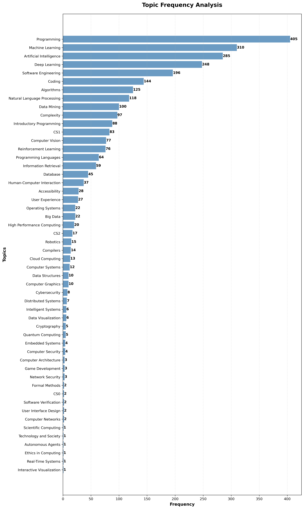

# iticse-2025-wg2
A collection of tools to help the systematic literature review for WG2 at ITiCSE 2025. Sample data in the folders.



## Utilities

### tf-idf.py
Performs Term Frequency-Inverse Document Frequency analysis on BibTeX files to identify key terms and themes in academic literature.
```bash
python tf-idf.py -f bibfiles/acm_chatgpt.bib -o chatgpt_analysis.txt -v
```

### topic_frequency.py
Analyzes the frequency of specific topics within BibTeX files and generates horizontal bar charts for visualization.
```bash
python topic_frequency.py -t topics.txt -b bibfiles/acm_chatgpt.bib -p --max-topics 15
```

### find_dois.py
Searches the Crossref database to find DOIs for academic papers using their titles.
```bash
python find_dois.py -f paper_titles.txt -v -o found_dois.csv
```

### doi_overlap.py
Compares DOIs from a reference list with DOIs in BibTeX files to identify coverage gaps and overlaps.
```bash
python doi_overlap.py -d target_dois.txt -b my_bibliography.bib -v
```

### set_of_DOIs.py
Extracts all unique DOIs from multiple BibTeX files in a directory and creates a consolidated list.
```bash
python set_of_DOIs.py -d bibfiles/ -o unique_dois.txt -v
```

### check_dois_valid.py
Validates DOIs by checking them against the Crossref database to ensure they are legitimate and accessible.
```bash
python check_dois_valid.py -f doi_list.txt -c 5 -o validation_results.csv
```

## Requirements
- Python 3.6+
- matplotlib (for plotting): `pip install matplotlib`
- requests (for API calls): `pip install requests`

## Sample Workflow
0. Find DOIs from paper titles: `python find_dois.py -f paper_titles.txt`
1. Extract DOIs from your bibliography: `python set_of_DOIs.py -d bibfiles/`
2. Validate the DOIs: `python check_dois_valid.py -f unique_dois.txt`
3. Analyze topic frequencies: `python topic_frequency.py -t topics.txt -b bibfiles/acm_final.bib -p`
4. Perform TF-IDF analysis: `python tf-idf.py -f bibfiles/acm_final.bib -v`
5. Analyze coverage against a validation set: `python doi_overlap.py -d target_dois.txt -b bibfiles/acm_final.bib`


