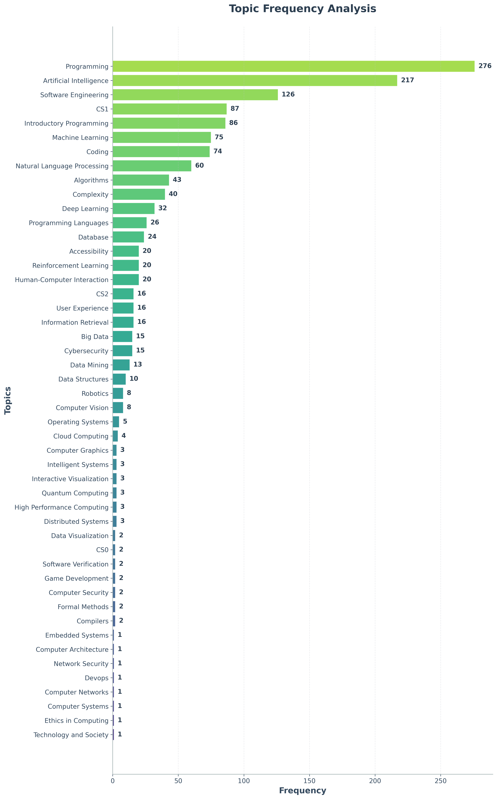

# ITiCSE 2025 WG2 Systematic Literature Review Tools
A collection of tools to help the systematic literature review for WG2 at ITiCSE 2025. Sample data in the folders.

The primary aim of the working group if to systematically review the literature on the use of generative AI in upper-level computer science education. The secondary aim is to survey evaluators on their experiences with generative AI in computer science education, specifically in the upper-level courses. The tertiary aim is to create a set of recommendations, competencies, guidelines, and best practices for the use of generative AI in upper-level computer science education to help teachers transition there courses into the generative age.

## Search String

The SRL is driven by the following search string:

Domain:
```sql
("computer science" OR "computer engineering" OR "software engineering" OR "cs education" OR "csed" OR "cse")
```
Generative AI:
```sql
AND ("generative" OR "large language model" OR "large language models" OR "llm" OR "llms" OR "gpt" OR "gpt-3" OR "gpt-3.5" OR "gpt-4" OR "gpt-4o" OR "o1" OR "o3" OR "chatgpt" OR "openai" OR "gemini" OR "bard" OR "claude" OR "copilot" OR "llama" OR "mixtral" OR "deepseek" OR "codex")
```
Pedagogical:
```sql
AND ("education" OR "teaching" OR "pedagogy" OR "student" OR "students" OR "learner" OR "learners" OR "teacher" OR "teachers" OR "curriculum" OR "course" OR "courses" OR "course design" OR "assignment" OR "homework" OR "project" OR "capstone" OR "coursework" OR "assessment" OR "grading" OR "examination" OR "exam" OR "learning outcome" OR "learning outcomes" OR "learning objective" OR "learning objectives" OR "competence" OR "competency" OR "competencies" OR "policy" or "policies")
```

> Note see the [`query.md`](query.md) file for the full query development and its varients and the results of the search against the validation set.

## Frequency of CS Subjects in paper collection



> Note: The chart above shows the frequency of various computer science subjects in the collected papers. However, this is the unfiltered set of papers, so there are many papers that are not relevant to the working group. The topics are simply extracted from the paper abstracts and titles using our curated list of computing topics (see: [`resources/topics.txt`](resources/topics.txt)).

## CS Subject Classification Results


> Note: This chart shows the distribution of papers across computer science course subjects as classified by OpenAI's GPT-4o model. The classification is based on paper titles and abstracts, providing insights into which CS education areas are most represented in the literature on generative AI.

## TF-IDF Analysis of most relevant topics

Found 987 documents with text content
Calculating TF-IDF scores...
Vocabulary size after filtering: 5539 terms
Min document frequency: 2
Max document frequency: 789

| Rank | Term | TF-IDF Score | Rank | Term | TF-IDF Score | Rank | Term | TF-IDF Score |
|------|------|--------------|------|------|--------------|------|------|--------------|
| 1 | code | 8.8914 | 18 | design | 4.8275 | 35 | artificial | 4.1858 |
| 2 | programming | 8.3993 | 19 | model | 4.7928 | 36 | large | 4.1127 |
| 3 | students | 7.5580 | 20 | use | 4.7757 | 37 | human | 3.8371 |
| 4 | llms | 7.5478 | 21 | llm | 4.7130 | 38 | system | 3.7961 |
| 5 | chatgpt | 7.4681 | 22 | models | 4.6398 | 39 | technology | 3.7376 |
| 6 | software | 7.2976 | 23 | research | 4.5720 | 40 | using | 3.7318 |
| 7 | learning | 6.4626 | 24 | their | 4.5305 | 41 | educational | 3.7253 |
| 8 | education | 6.2118 | 25 | our | 4.5176 | 42 | paper | 3.7157 |
| 9 | generative | 6.0853 | 26 | student | 4.5047 | 43 | development | 3.6996 |
| 10 | genai | 5.8253 | 27 | language | 4.4863 | 44 | knowledge | 3.6426 |
| 11 | data | 5.6778 | 28 | questions | 4.4420 | 45 | analysis | 3.6318 |
| 12 | tools | 5.3515 | 29 | study | 4.3863 | 46 | challenges | 3.6221 |
| 13 | science | 5.0773 | 30 | course | 4.2925 | 47 | acm | 3.6214 |
| 14 | computer | 5.0335 | 31 | systems | 4.2775 | 48 | cs1 | 3.5846 |
| 15 | engineering | 4.9939 | 32 | generation | 4.2599 | 49 | international | 3.5729 |
| 16 | feedback | 4.9457 | 33 | intelligence | 4.2381 | 50 | symposium | 3.5362 |
| 17 | computing | 4.8788 | 34 | teaching | 4.2044 |  |  |  |

> Note: The table above shows the top 25 terms with the highest TF-IDF scores from the analysis of the collected papers. This indicates their relevance and importance in the context of generative AI in computer science education. The BibTeX file used for this is the best performing on the ACM DL, which is [`bibfiles/acm_searcH_string.bib`](bibfiles/acm_search_string.bib).

## Tools Overview

### Find DOIs from Titles
Searches the Crossref database to find DOIs for academic papers using their titles.
```bash
python find_dois.py -f paper_titles.txt -v -o found_dois.csv
```

### Check for valid DOIs
Validates DOIs by checking them against the Crossref database to ensure they are legitimate and accessible.
```bash
python check_dois_valid.py -f doi_list.txt -c 5 -o validation_results.csv
```

### Find Overlap between list of DOIs and BibTeX file
Compares DOIs from a reference list with DOIs in BibTeX files to identify coverage gaps and overlaps.
```bash
python doi_overlap.py -d target_dois.txt -b my_bibliography.bib -v
```

### Set of all DOIs
Extracts all unique DOIs from multiple BibTeX files in a directory and creates a consolidated list.
```bash
python set_of_dois.py -d bibfiles/ -o unique_dois.txt -v
```

### Topic Frequency Analysis
Analyzes the frequency of specific topics within BibTeX files and generates horizontal bar charts for visualization.
```bash
python topic_frequency.py -t topics.txt -b bibfiles/acm_chatgpt.bib -p --max-topics 15
```

### TF-IDF Analysis
Performs Term Frequency-Inverse Document Frequency analysis on BibTeX files to identify key terms and themes in academic literature.
```bash
python tf_idf.py -f bibfiles/acm_chatgpt.bib -o chatgpt_analysis.txt -v
```

### Subject Vibe Classification
Uses OpenAI's API to automatically classify academic papers into computer science course subjects based on titles and abstracts. Now includes horizontal bar chart generation with beautiful fading color palettes.

```bash
# Basic classification
python subject_vibe.py -f bibfiles/acm_chatgpt.bib -o cs_classifications.csv -n 10 -v

# Classification with chart generation
python subject_vibe.py -f bibfiles/acm_chatgpt.bib -o cs_classifications.csv -p --chart-output subject_chart.png

# Batch processing with custom chart settings
python subject_vibe.py -f bibfiles/acm_final.bib -o results.csv --batch-size 5 -p --max-subjects 15
```

### Subject Chart Generation (Standalone)
Generate beautiful horizontal bar charts from existing subject classification CSV files.

```bash
# Basic chart from CSV
python subject_chart.py -f output/subject_vibes.csv

# Custom chart with specific settings
python subject_chart.py -f data.csv -o custom_chart.png --max-subjects 15 --title "CS Research Distribution"

# Verbose output with detailed statistics
python subject_chart.py -f data.csv -v --max-subjects 20
```

## Requirements
- Python 3.6+
- matplotlib (for plotting): `pip install matplotlib`
- requests (for API calls): `pip install requests`
- openai (for subject classification): `pip install openai`

> Note: You need your own OpenAI API key for the subject classification tool. Set it in your environment variables as `OPENAI_API_KEY`.

## Sample Workflow
0. Find DOIs from paper titles: `python find_dois.py -f paper_titles.txt`
1. Extract DOIs from your bibliography: `python set_of_dois.py -d bibfiles/`
2. Validate the DOIs: `python check_dois_valid.py -f unique_dois.txt`
3. Analyze topic frequencies with charts: `python topic_frequency.py -t topics.txt -b bibfiles/acm_final.bib -p`
4. Perform TF-IDF analysis: `python tf_idf.py -f bibfiles/acm_final.bib -v`
5. Classify papers by CS course subject with visualization: `python subject_vibe.py -f bibfiles/acm_final.bib -o course_classifications.csv -n 20 -p`
6. Generate standalone subject charts: `python subject_chart.py -f course_classifications.csv -v`
7. Analyze coverage against a validation set: `python doi_overlap.py -d target_dois.txt -b bibfiles/acm_final.bib`


